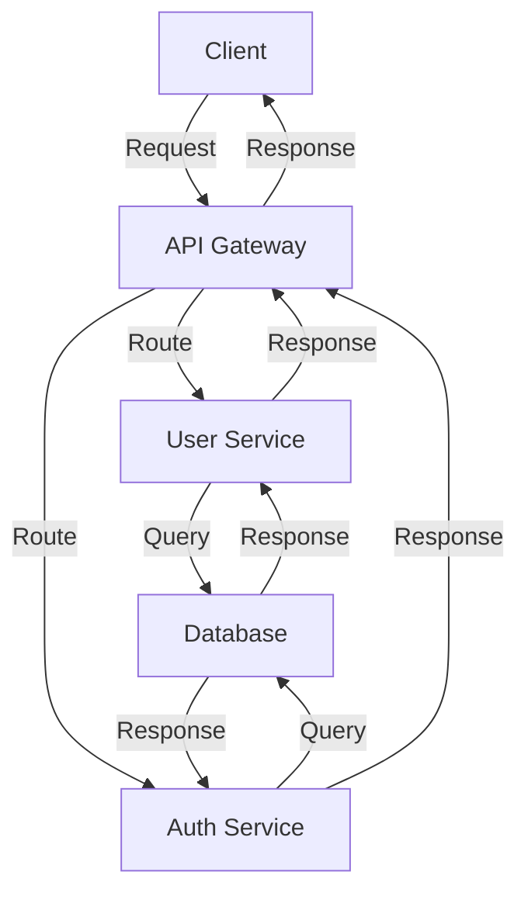

# Documentation Standards

## Overview

This guide establishes comprehensive documentation standards for the Advanced AI Agent System. Consistent, high-quality documentation improves code understanding, reduces onboarding time, and facilitates knowledge sharing across the development team.

---

## 1. Documentation Types

### 1.1 Architecture Documentation

**Purpose:** Describe system structure, components, and interactions

**Contents:**
- System overview
- Component diagrams
- Architecture patterns
- Data flow diagrams
- Integration points
- Technology choices and rationale

**Location:** `/docs/architecture/`

**Template:**
```markdown
# [System/Component] Architecture

## Overview
Brief description of the component/system.

## Architecture Diagram
[ASCII or external diagram]

## Components
- Component A: Description
- Component B: Description

## Data Flow
Step-by-step data flow description.

## Technology Stack
- Language: Description
- Framework: Description

## Design Decisions
Explain why specific choices were made.

## Scaling Considerations
How does it scale?

## Security Considerations
Key security aspects.
```

### 1.2 API Documentation

**Purpose:** Document endpoints, parameters, responses, and usage

**Contents:**
- Base URL
- Authentication
- Endpoints (method, path, description)
- Request parameters
- Response formats
- Error codes
- Examples
- Rate limiting

**Location:** `/docs/api/`

**Tool Options:**
- OpenAPI/Swagger
- Postman collections
- API Blueprint
- Markdown with examples

**Example:**
```markdown
# User API

## Base URL
`https://api.example.com/v1`

## Authentication
Bearer token in Authorization header.

## Endpoints

### Get User
`GET /users/{userId}`

**Parameters:**
- userId (path, required): User ID

**Response:**
```json
{
  "id": "123",
  "name": "John Doe",
  "email": "john@example.com"
}
```

**Error Codes:**
- 404: User not found
- 401: Unauthorized

### Create User
`POST /users`

**Request Body:**
```json
{
  "name": "Jane Doe",
  "email": "jane@example.com"
}
```

**Response:** 201 Created
```json
{
  "id": "124",
  "name": "Jane Doe",
  "email": "jane@example.com"
}
```
```

### 1.3 User/Developer Guides

**Purpose:** Help users understand how to use the system

**Contents:**
- Getting started
- Installation/setup
- Configuration
- Common use cases
- Troubleshooting
- FAQ

**Location:** `/docs/guides/`

**Structure:**
```
guides/
├── getting_started.md
├── installation.md
├── configuration.md
├── user_guide.md
├── troubleshooting.md
└── faq.md
```

### 1.4 Code Documentation

**Purpose:** Explain what code does and why

**Types:**
- Inline comments
- JSDoc/TypeDoc
- README files
- Architecture decision records (ADRs)

**Location:** Directly in code files

### 1.5 Release Notes

**Purpose:** Communicate changes to users and developers

**Contents:**
- Version number
- Release date
- New features
- Bug fixes
- Breaking changes
- Deprecations
- Migration guide

**Location:** `/CHANGELOG.md` or `/docs/releases/`

**Format:**
```markdown
# Changelog

## [1.0.0] - 2025-10-26

### Added
- New authentication service
- API rate limiting
- User roles and permissions

### Fixed
- Memory leak in cache handler
- Incorrect error messages

### Changed
- Updated dependencies to latest versions
- Improved error handling

### Deprecated
- Legacy user service (use new AuthService)

### Removed
- Old API v1 endpoints

### Breaking Changes
- `UserService.authenticate()` renamed to `AuthService.login()`
- Response format changed for `/users` endpoint

### Migration Guide
1. Update imports from UserService to AuthService
2. Rename authenticate() calls to login()
3. Handle new response format in consuming code
```

### 1.6 Operational Documentation

**Purpose:** Guide operators and support staff

**Contents:**
- Deployment procedures
- Monitoring and alerts
- Incident response
- Backup/restore procedures
- Maintenance tasks
- Troubleshooting

**Location:** `/docs/operations/`

---

## 2. Code Documentation Standards

### 2.1 JSDoc/TypeDoc Comments

**Function Documentation:**
```javascript
/**
 * Processes user data and returns formatted result
 * 
 * @param {Object} user - User object to process
 * @param {string} user.id - User ID (required, unique)
 * @param {string} user.email - User email (required, valid email)
 * @param {string} user.name - User full name (required)
 * @param {Object} options - Processing options (optional)
 * @param {boolean} options.validateEmail - Email validation (default: true)
 * @param {boolean} options.trimWhitespace - Trim strings (default: true)
 * 
 * @returns {Promise<FormattedUser>} Promise resolving to formatted user
 * @returns {string} result.id - User ID
 * @returns {string} result.email - Normalized email
 * @returns {string} result.name - Trimmed name
 * @returns {Date} result.processedAt - Processing timestamp
 * 
 * @throws {ValidationError} If user data is invalid
 * @throws {TypeError} If options parameter is not an object
 * 
 * @example
 * const user = { id: '123', email: 'john@example.com', name: 'John Doe' };
 * const result = await processUser(user);
 * console.log(result.processedAt);
 * 
 * @example
 * // With options
 * const result = await processUser(user, { validateEmail: false });
 * 
 * @deprecated Use ProcessorService.process() instead
 * @since 1.0.0
 * @author John Doe
 */
async function processUser(user, options = {}) {
  // Implementation
}
```

**Class Documentation:**
```javascript
/**
 * Service for handling user operations
 * 
 * Provides CRUD operations for user management with caching
 * and validation. Implements singleton pattern.
 * 
 * @class UserService
 * @singleton
 * 
 * @example
 * const service = UserService.getInstance();
 * const user = await service.getUserById('123');
 * 
 * @see DatabaseService
 * @see CacheService
 */
class UserService {
  /**
   * Gets UserService instance (singleton)
   * @returns {UserService} Service instance
   */
  static getInstance() {
    // Implementation
  }
  
  /**
   * Retrieves user by ID with caching
   * @param {string} userId - User ID to retrieve
   * @returns {Promise<User|null>} User object or null if not found
   * @throws {DatabaseError} If database query fails
   */
  async getUserById(userId) {
    // Implementation
  }
}
```

**Type Documentation:**
```javascript
/**
 * User object type definition
 * @typedef {Object} User
 * @property {string} id - Unique user identifier
 * @property {string} email - User email address (must be unique)
 * @property {string} name - User full name
 * @property {Array<string>} roles - User roles (e.g., 'admin', 'user')
 * @property {Date} createdAt - Account creation timestamp
 * @property {Date} updatedAt - Last update timestamp
 * @property {boolean} isActive - Account active status (default: true)
 */

/**
 * Format: "YYYY-MM-DD" or "YYYY-MM-DDTHH:mm:ss.sssZ"
 * @typedef {string} ISODate
 */
```

### 2.2 Inline Comments

**Best Practices:**

```javascript
// ❌ BAD - States the obvious
i++;  // Increment i

// ✅ GOOD - Explains WHY
// Start from index 1 because index 0 contains header row
for (let i = 1; i < rows.length; i++) {
  processRow(rows[i]);
}

// ❌ BAD - Too vague
// Check the thing
if (user.status === 'active') {
  // Do stuff
}

// ✅ GOOD - Clear explanation
// Only process active users to avoid operating on deleted accounts
if (user.status === 'active') {
  processUserData(user);
}

// ❌ BAD - Unclear intent
const x = calculateSomething();
if (x > 100) {
  // Something important
}

// ✅ GOOD - Clear intent with reasoning
const processingTimeMs = calculateElapsedTime();
// Flag as slow if exceeds SLA of 100ms
if (processingTimeMs > 100) {
  logSlowOperation(processingTimeMs);
}
```

**Comment Guidelines:**
- Explain **why**, not **what**
- One line for simple explanations
- Multiple lines for complex logic
- Update comments when code changes
- Remove outdated comments
- No commented-out code

### 2.3 Complex Logic Documentation

```javascript
/**
 * Complex algorithm explanation
 * 
 * This implements the Needleman-Wunsch algorithm for sequence alignment.
 * The algorithm works by:
 * 1. Creating a scoring matrix
 * 2. Computing similarity scores through dynamic programming
 * 3. Backtracking to find optimal alignment
 * 
 * Time complexity: O(m*n) where m and n are sequence lengths
 * Space complexity: O(m*n) for the scoring matrix
 */
function alignSequences(seq1, seq2) {
  // Step 1: Initialize matrix
  const matrix = initializeMatrix(seq1, seq2);
  
  // Step 2: Fill matrix with similarity scores
  for (let i = 1; i <= seq1.length; i++) {
    for (let j = 1; j <= seq2.length; j++) {
      // Compare characters and use substitution matrix
      const matchScore = seq1[i-1] === seq2[j-1] ? 1 : -1;
      matrix[i][j] = Math.max(
        matrix[i-1][j] - 1,      // Gap in seq2
        matrix[i][j-1] - 1,      // Gap in seq1
        matrix[i-1][j-1] + matchScore  // Match/mismatch
      );
    }
  }
  
  // Step 3: Backtrack to find alignment
  return backtrack(matrix, seq1, seq2);
}
```

---

## 3. README Files

### 3.1 Project README

**Location:** `/README.md` (root)

**Structure:**
```markdown
# Project Name

Brief one-sentence description.

## Table of Contents
- [Features](#features)
- [Quick Start](#quick-start)
- [Installation](#installation)
- [Configuration](#configuration)
- [Usage](#usage)
- [Architecture](#architecture)
- [Testing](#testing)
- [Contributing](#contributing)
- [License](#license)

## Features
- Feature 1
- Feature 2
- Feature 3

## Quick Start
```bash
npm install
npm run dev
```

## Installation
Detailed installation steps.

## Configuration
How to configure the project.

## Usage
How to use the project.

## Architecture
System design and components.

## Testing
How to run tests.

## Contributing
Contribution guidelines.

## License
License information.

## Support
How to get help.

## Authors
- Author 1
- Author 2
```

### 3.2 Module/Package README

**Location:** `/src/module-name/README.md`

**Structure:**
```markdown
# Module Name

Brief description of what this module does.

## Overview
Detailed explanation of module purpose and scope.

## Components
- Component A: Description
- Component B: Description

## Usage Examples
```javascript
// Example 1
const service = new ModuleService();
await service.doSomething();

// Example 2
import { helper } from './module';
const result = helper.process(data);
```

## API Reference
Document main exports and functions.

## Dependencies
List of dependencies and why they're needed.

## See Also
- Related modules
- External documentation
```

---

## 4. Architecture Decision Records (ADRs)

**Purpose:** Document major technical decisions and their rationale

**Location:** `/docs/adr/`

**Template:**
```markdown
# ADR-001: Use NoSQL Database for User Profiles

## Status
Accepted | Pending | Deprecated | Superseded by ADR-XXX

## Context
Describe the issue/decision needed. Include constraints and requirements.

The application needs to store rapidly evolving user profile data
with flexible schema. Requirements include:
- High throughput (10k+ writes/sec)
- Flexible schema for experimentation
- Easy horizontal scaling
- Real-time queries

## Decision
We will use MongoDB as our primary NoSQL database for user profiles.

## Rationale
- Handles rapid schema changes without migrations
- Excellent horizontal scaling via sharding
- Rich query language and aggregation framework
- Large community and ecosystem
- Good Node.js driver support

## Alternatives Considered
1. **PostgreSQL with JSONB**
   - Pros: ACID guarantees, familiar SQL
   - Cons: Slower scaling, rigid schema by default

2. **Cassandra**
   - Pros: Excellent scaling, high availability
   - Cons: Complex operational requirements, eventual consistency

3. **DynamoDB**
   - Pros: AWS managed, good scaling
   - Cons: Expensive for our scale, limited query flexibility

## Consequences

### Positive
- Easy iteration on user profile schema
- Better handles concurrent writes
- Simpler horizontal scaling

### Negative
- Less data consistency guarantees (eventual consistency)
- Larger operational complexity
- Requires careful indexing strategy

## Implementation Details
- Use MongoDB 4.4+ with replication
- Connect via Mongoose ORM
- Implement data validation at application layer

## Related Decisions
- ADR-002: Database replication strategy
- ADR-003: Data backup procedures

## References
- [MongoDB vs PostgreSQL comparison]
- [MongoDB horizontal scaling guide]

## Approval
- Approved by: Tech Lead
- Date: 2025-10-26
- Reviewed by: Architecture Team
```

---

## 5. Markdown Standards

### 5.1 Formatting

**Headings:**
```markdown
# H1 - Main title (document title only)
## H2 - Major sections
### H3 - Subsections
#### H4 - Sub-subsections
```

**Emphasis:**
```markdown
*Italic* or _italic_
**Bold** or __bold__
***Bold italic***
~~Strikethrough~~
```

**Code:**
```markdown
Inline `code snippet`

Code block:
```javascript
function example() {
  return true;
}
```
```

**Lists:**
```markdown
Unordered:
- Item 1
- Item 2
  - Nested item

Ordered:
1. First
2. Second
   1. Nested item
```

**Links:**
```markdown
[Link text](https://example.com)
[Link to section](#section-name)
[Relative link](../other-file.md)
```

**Tables:**
```markdown
| Header 1 | Header 2 | Header 3 |
|----------|----------|----------|
| Cell 1.1 | Cell 1.2 | Cell 1.3 |
| Cell 2.1 | Cell 2.2 | Cell 2.3 |
```

### 5.2 Structure Best Practices

**File Organization:**
```
# Main Title

## Table of Contents
- [Section 1](#section-1)
- [Section 2](#section-2)

## Section 1
Content here.

### Subsection 1.1
Content here.

## Section 2
Content here.

## See Also
- Related documents
```

**Line Length:**
- Aim for 80 characters
- No hard requirement for prose
- Code blocks can exceed

**Spacing:**
- Blank line between sections
- Blank line before code blocks
- No extra blank lines within paragraphs

---

## 6. Visual Documentation

### 6.1 Diagrams

**Use Cases:**
- Architecture diagrams
- Data flow diagrams
- Sequence diagrams
- Entity-relationship diagrams
- User flows
- State machines

**Tools:**
- Mermaid (text-based, in markdown)
- PlantUML (code-based, multiple formats)
- Lucidchart (visual, collaborative)
- Draw.io (visual, free)
- ASCII art (simple, version controllable)

**Mermaid Example:**
```markdown

```

### 6.2 Screenshots and Images

**Guidelines:**
- Use for UI/UX documentation
- Include captions
- Highlight important areas with annotations
- Keep file sizes reasonable (compressed)
- Use PNG for screenshots, SVG for diagrams

**Naming:**
```
screenshot-feature-name.png
diagram-system-architecture.svg
architecture-components.png
```

---

## 7. Example Documentation

### 7.1 Function with Complete Documentation

```javascript
/**
 * Calculates optimal resource allocation using linear programming
 * 
 * Uses the Simplex algorithm to solve linear optimization problems
 * with the given constraints and objective function.
 * 
 * @param {Object} problem - Linear programming problem
 * @param {Array<number>} problem.objective - Objective function coefficients
 * @param {Array<Array<number>>} problem.constraints - Constraint matrix
 * @param {Array<string>} problem.operators - Constraint operators ('<=', '>=', '=')
 * @param {Array<number>} problem.bounds - Right-hand side bounds
 * @param {Object} options - Algorithm options (optional)
 * @param {number} options.maxIterations - Maximum iterations (default: 1000)
 * @param {number} options.tolerance - Convergence tolerance (default: 1e-6)
 * @param {boolean} options.debug - Enable debug logging (default: false)
 * 
 * @returns {Object} Solution object
 * @returns {Array<number>} result.values - Optimal variable values
 * @returns {number} result.objectiveValue - Optimal objective value
 * @returns {boolean} result.isOptimal - Whether optimal solution found
 * @returns {number} result.iterations - Number of iterations used
 * @returns {string} result.status - 'OPTIMAL', 'UNBOUNDED', or 'INFEASIBLE'
 * 
 * @throws {ValidationError} If problem is invalid or unsolvable
 * @throws {ConvergenceError} If algorithm fails to converge
 * 
 * @example
 * // Maximize: 3x + 2y
 * // Subject to: x + y <= 10, x <= 7, y <= 5
 * const problem = {
 *   objective: [3, 2],
 *   constraints: [[1, 1], [1, 0], [0, 1]],
 *   operators: ['<=', '<=', '<='],
 *   bounds: [10, 7, 5]
 * };
 * 
 * const solution = solveLinearProgram(problem);
 * console.log(solution.objectiveValue); // 23
 * console.log(solution.values); // [7, 3]
 * 
 * @complexity Time: O(n²m) where n is variables, m is constraints
 * @complexity Space: O(nm)
 * 
 * @see https://en.wikipedia.org/wiki/Simplex_algorithm
 * @author Algorithm Implementation Team
 * @version 2.0.0
 * @since 1.5.0
 */
function solveLinearProgram(problem, options = {}) {
  // Implementation
}
```

---

## 8. Documentation Maintenance

### 8.1 Keeping Documentation Current

**Best Practices:**
- Update docs when code changes
- Review docs in code review
- Run automated documentation generation
- Regular documentation audits (quarterly)
- Deprecation notices for outdated content

**Triggers for Documentation Update:**
- [ ] API changes
- [ ] Configuration changes
- [ ] Architecture changes
- [ ] New features added
- [ ] Bug fixes that affect usage
- [ ] Dependencies updated
- [ ] Performance characteristics change

### 8.2 Documentation Audits

**Quarterly Review Checklist:**
- [ ] README still accurate
- [ ] API docs match implementation
- [ ] Examples still work
- [ ] Links aren't broken
- [ ] No deprecated information
- [ ] Technical accuracy verified
- [ ] Screenshots up-to-date
- [ ] Troubleshooting still relevant

### 8.3 Tools for Documentation

**Documentation Generators:**
- JSDoc → HTML documentation
- TypeDoc → TypeScript documentation
- Swagger/OpenAPI → Interactive API docs
- Sphinx → Python documentation
- GitBook → Beautiful documentation sites

**Continuous Documentation:**
```yaml
# Example CI/CD integration
on: [push]
jobs:
  docs:
    runs-on: ubuntu-latest
    steps:
      - uses: actions/checkout@v2
      - name: Generate Documentation
        run: npm run docs
      - name: Deploy to GitHub Pages
        uses: peaceiris/actions-gh-pages@v3
        with:
          github_token: ${{ secrets.GITHUB_TOKEN }}
          publish_dir: ./docs
```

---

## 9. Documentation Checklist

**For Every Feature/Component:**
- [ ] Purpose clearly described
- [ ] Usage examples provided
- [ ] Edge cases documented
- [ ] Error cases documented
- [ ] Performance characteristics noted
- [ ] Dependencies listed
- [ ] Version information included
- [ ] Links to related docs

**For Every PR:**
- [ ] README updated (if needed)
- [ ] API docs updated (if needed)
- [ ] Examples added (if needed)
- [ ] Comments added (if complex)
- [ ] JSDoc added (if public API)
- [ ] Architecture docs updated (if major change)
- [ ] Troubleshooting updated (if needed)

**For Every Release:**
- [ ] Changelog updated
- [ ] Migration guide (if breaking)
- [ ] Release notes written
- [ ] Deprecated features noted
- [ ] API documentation current
- [ ] Examples tested

---

## 10. Quick Reference

### Documentation Templates
- Architecture ADRs at `/docs/adr/`
- API docs using OpenAPI/Swagger
- User guides in `/docs/guides/`
- Inline comments in code
- JSDoc for public APIs
- README files in each module

### Key Standards
- **Clarity:** Write for your audience
- **Completeness:** Cover key aspects
- **Accuracy:** Keep information current
- **Consistency:** Use standard format
- **Accessibility:** Make easy to find

### Tools
- Markdown for most documentation
- Mermaid for diagrams
- JSDoc for code documentation
- Swagger for APIs
- GitHub Pages for hosting

---

## Conclusion

Consistent, comprehensive documentation improves code quality, reduces development time, and facilitates knowledge sharing. Follow these standards to maintain high-quality documentation across the Advanced AI Agent System.

**Remember:** Good documentation is an investment in team productivity and code longevity! 📚

